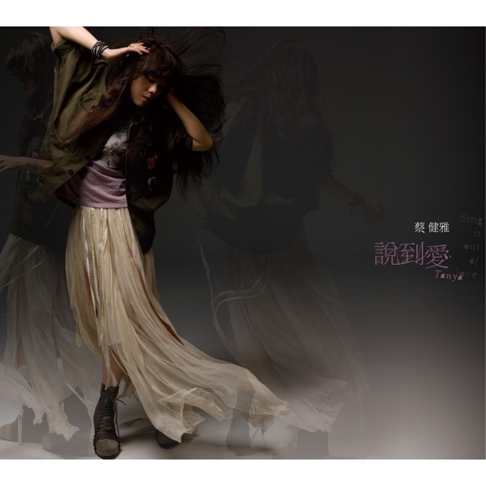
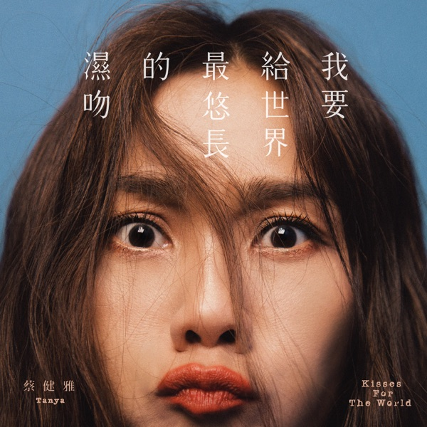

## My Life
Welcome to the personal side of my website! I'm excited to share something outside of research. If you find something we have in common, feel free to reach out—I’d love to connect!

## Music

I want to talk about [Tanya Chua](https://en.wikipedia.org/wiki/Tanya_Chua) here, one of the songwriters I love the most. She is a Singaporean singer-songwriter. I love her song-writing, the melody seems simple but full of softness and novelty. I also admire her unique tone and rhythm that flows naturally within her songs, even though she doesn't see herself as an R&B singer. 

[Click here to see more details.](tanyachua.md)

The three albums below are my favorite works by Tanya Chua. They hold a special place in my heart.

  <figure style="width: 30%;">
    
    <figcaption>Sing It Out of Love</figcaption>
  </figure>
  <figure style="width: 30%;">
    
    <figcaption>Kisses For The World</figcaption>
  </figure>
  <figure style="width: 30%;">
    
    <figcaption>Depart</figcaption>
  </figure>

## Travel

## Events
